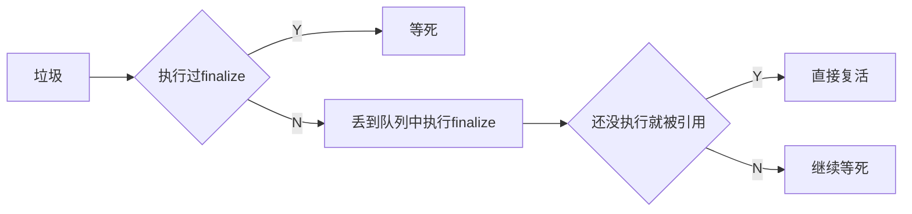

# 垃圾回收机制

## 一、垃圾

### 1.1 什么是垃圾

在Java中，没有被任何一个对象引用的实例，就会被当作垃圾来回收

### 1.2 怎样判断垃圾

有两种方式来判断

#### 引用计数

> 每有一个对象引用该实例，它的值就加1
>
> 当值为0时，说明没有对象引用它，就可以确认为垃圾。

但是它存在一个缺陷，即无法判断**循环引用**的垃圾

因此，往往需要考虑许多额外的情况，才能让这个算法正确运行。

#### 可达性分析算法

> 从GC Roots的根对象开始向下搜索，如果某个实例没有和GC Roots相连，就表明它是垃圾

在这种算法中，如何选择`GC Roots`就是很关键的一点。

Java中固定可作为GC Roots的有以下几项：

1. 虚拟机栈中引用的对象
2. 方法区中常量、静态变量引用的对象
3. 本地方法栈中`native`方法引用的对象
4. 虚拟机内部的引用，包括基本数据类型的Class对象，常驻的异常对象等
5. 被同步锁持有的对象

除了固定的`GC Roots`集合外，可以根据用户所选择的垃圾回收器及当前回收的区域不同，而"临时性"地加入一些其他对象。

#### 再谈引用

在JDK1.2以前，引用是非常传统的定义，即

> reference类型的数据中存储的数值代表是另一块内存的地址，就称该reference是代表某块内存、某个对象的引用

而这样简单的定义，又无法来表示那些`食之无味，弃之可惜`的对象

因此，JDK1.2以后，Java的引用扩充成了4种，主要有：

- 强引用
- 软引用
- 弱引用
- 虚引用

它们各自的表现如下

| 引用名 |                            描述                            |
| :----: | :--------------------------------------------------------: |
| 强引用 |                        符合传统定义                        |
| 软引用 |                   内存快溢出时，进行回收                   |
| 弱引用 |                  下一次垃圾回收时必定回收                  |
| 虚引用 | 最弱，目的只是为了让这个对象在被回收时，能收到一个系统通知 |

#### 只有一次的复活甲

当一个对象被发现时没有与`GC Roots`相连，它就会被认定为是垃圾

但是它还有一次复活的机会，那这个机会在哪里呢？让我们慢慢道来

## 二、基本回收算法

最基础的回收算法有三种，它们各有特色。

### 1. 标记-清除

描述：标记垃圾，然后统一清除

缺点：

1. 产生碎片
2. 标记清除的过程效率低

### 2. 标记-复制

描述：内存分半，标记时把所有存活对象复制到另一半，然后直接清空当前这一半

缺点：空间浪费

特点：

1. 存活对象较少时，复制消耗少，运行高效

2. 避免碎片化

**因为新生代存活对象较少，所以适合标记-复制算法。**

### 3. 标记-整理

描述：标记时把存活对象移动到一起，然后统一清除剩余部分

特点：

1. 性能较差
2. 避免碎片化

## 三、分代

**为什么要分代？**

因为对象有两类，有的存活时间长，有的存活时间短

把他们分开来，用不同的回收算法来处理，就可以做到时间和空间的高效利用。

**怎么分代呢？**

首先把`堆空间`按1：2分为新生代和老年代

新生代又基于`大部分对象都活的不久`的事实，按8：1：1分为伊甸区、两个存活区。

其中新生代大部分都是要回收的垃圾

## 四、垃圾收集器

在分代时期，新生代和老年代各有3种垃圾收集器

如果没有具体介绍回收算法，那么新生代统一使用`标记-复制`算法，老年代统一使用`标记-整理`算法。

### 新生代

#### Serial

用单一线程来执行垃圾回收，且回收时用户线程必须暂停

#### ParNew

`Serial`的多线程版本，一般用来和`CMS`合作进行

#### Parallel Scavenge

也是多线程进行回收，但是它的关注点不同。

其他的垃圾收集器关注用户线程的停顿时间，以保证用户交互的质量；

而`Parallel Scavenge`更加关注吞吐量，即用户线程运行时间与总时间的比值，适合后台运算而非交互，

### 老年代

#### Serial Old

老年代版的单线程回收方式。

#### Parallel Old

老年代版的多线程回收。

#### CMS

CMS全称为concurrent mark sweep，即并发标记清除，所以它是一种基于标记清除的算法，只不过实现得更加复杂。

主要分为四个过程：

1. **初始标记**

   暂停用户线程，由GC线程记录与GC Root相连的对象

2. **并发标记**

   用户线程和GC线程一起运行，GC线程从第一步发现的对象开始，往下搜索，记录可达对象

3. **重新标记**

   暂停用户线程，GC查看上一步标记过程中标记发生变化的区域，进行修正

4. **并发清除**

   开启用户线程，同时GC线程对未标记的区域进行清扫

缺点：

1. 因为是基于标记清除算法的，所以会有碎片
2. 并发操作时占用CPU资源
3. 清除时用户线程也在执行，所以需要预留空间，即提前进行回收。

## 五、G1收集器

自G1收集器开始，分代的概念越来越淡。

它的主要思想是**局部收集**和**独立分区**。

- **局部收集**

  指进行垃圾回收时，选择性价比最高的一些区域进行回收

- **独立分区**

  新生代和老年代不再是固定的了，它将堆内存分为多个大小相等的区域，然后每个区域根据需要，可以扮演原先分代中各区的角色。

**过程：**

1. 初始标记
2. 并发标记
3. 最终标记
4. 筛选回收